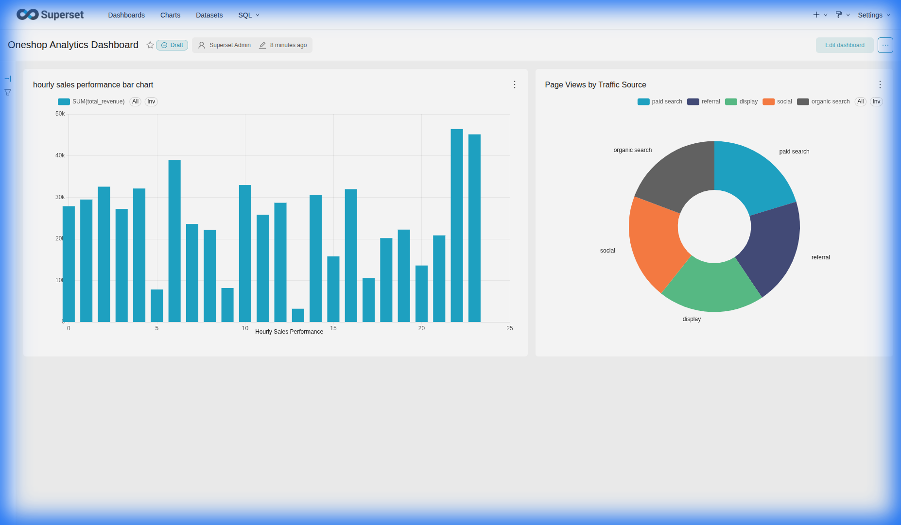
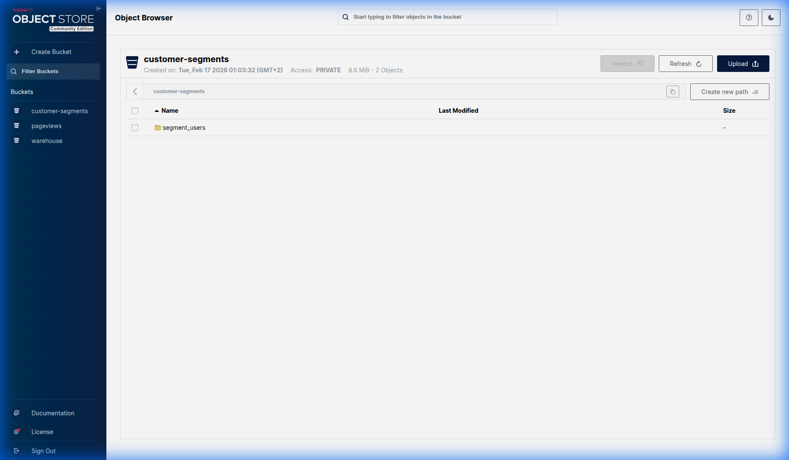
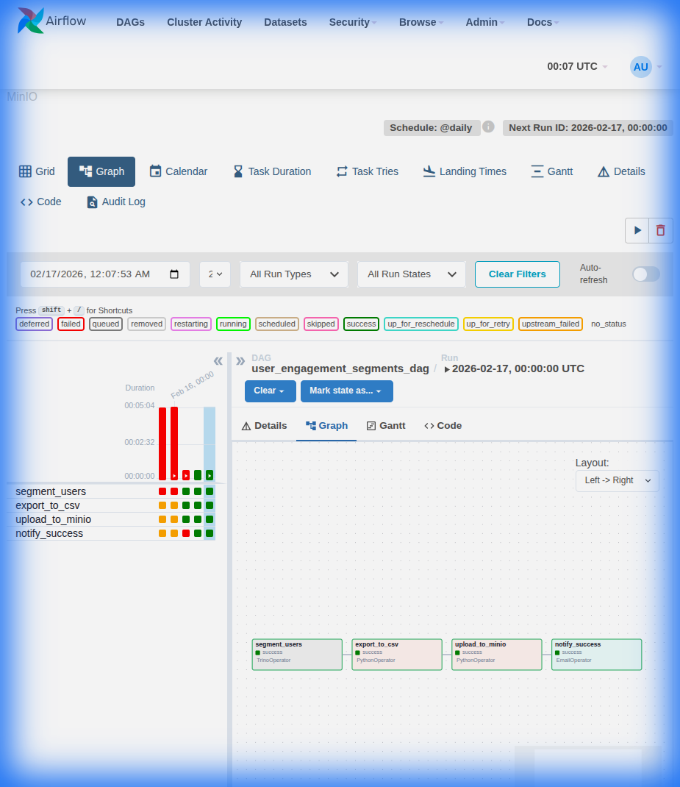
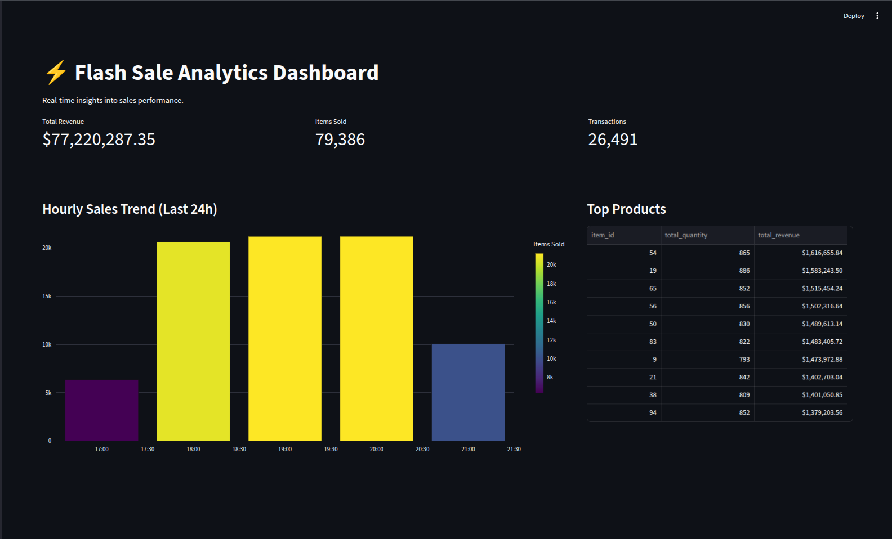
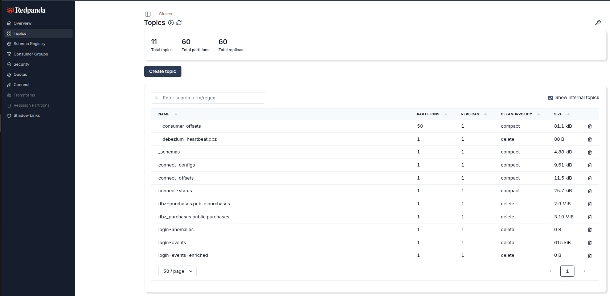
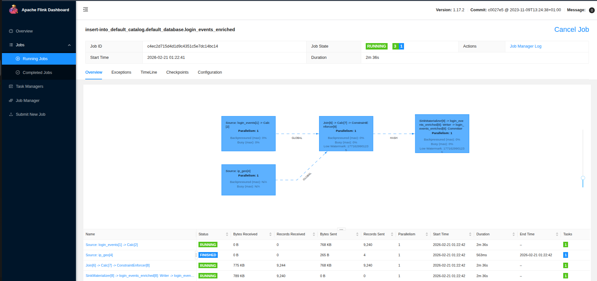
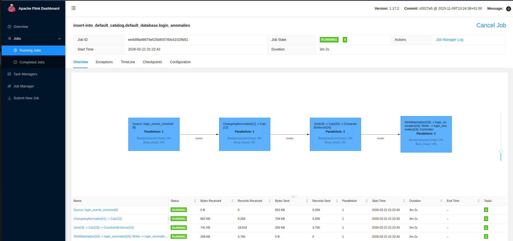

# Analytics Data Platform with a Modern Lakehouse Architecture



### Data Flow


> These diagrams describe the Docker Compose platform and intended end-to-end
> data paths. The Kubernetes migration is deliberately incremental; see the
> [current migration state](infrastructure/README.md#current-migration-state).

## Deployment and migration status

Docker Compose remains the complete reference implementation and rollback path.
Kubernetes currently contains only independently enabled and accepted local
slices; the default Helm values deploy no workload.

| Area | Status | Runtime state |
| --- | --- | --- |
| Discovery and Kubernetes foundation | Accepted | Documentation, feature policy, profiles, and validation tooling |
| Phase 2 lightweight slice | Runtime-accepted | Source CloudNativePG and retained 1 GiB PVC; hibernated |
| Phase 3A storage slice | Runtime-accepted | Main CloudNativePG and local S3 compatibility storage; two retained 2 GiB PVCs; hibernated |
| Phase 3B messaging | Not implemented | Kafka, Schema Registry, Connect, and CDC remain disabled |
| Phases 4-9 | Not implemented | Processing, analytics, observability, logging, delivery automation, and reliability work remain gated |

The authoritative progress, evidence, rollback boundary, and next approval gate
are in the [Kubernetes migration plan](docs/plans/kubernetes-migration.md).

## Production readiness

This repository is **not yet a production-ready platform deployment**. Phase 2
and Phase 3A are production-minded, runtime-tested local migration slices, not a
production environment. In particular, the accepted local state is single-node
kind, databases are single-instance, MinIO is an archived compatibility target,
transport is not comprehensively protected by TLS, logical backup is not PITR,
NetworkPolicy enforcement has not been proven with a policy-capable CNI, and
external secret management, observability, centralized logging, automated
delivery, image scanning/signing, SLOs, and disaster recovery remain incomplete.

Do not use the example Compose or local Kubernetes configurations for production
without closing the documented [migration risks](docs/platform/migration-risks.md)
and completing the remaining phase acceptance criteria.

## 🚀 Overview

This project demonstrates a **Modern Data Lakehouse** architecture, combining
data-lake and data-warehouse patterns for data engineering and analytics
workloads. The complete platform is currently Compose-oriented; the Kubernetes
path is being validated one resource-bounded slice at a time.

The platform follows the **Medallion Architecture** (Bronze → Silver → Gold) and is built on open standards, leveraging **Apache Iceberg** for table format, **Apache Spark** for compute, **Trino** for interactive queries, and **Apache Superset** for visualization.

## ✨ Key Features

-   **Open Table Format**: Apache Iceberg for ACID transactions, time travel, and schema evolution.
-   **Scalable Compute**: Apache Spark 3.5 for large-scale data processing (ETL).
-   **Real-time Streaming**: Kafka + Debezium for Change Data Capture (CDC) from Postgres.
-   **Search & Analytics**: OpenSearch for the current item-search integration; centralized logging is a later phase.
-   **Interactive SQL**: Trino for low-latency, ad-hoc analytical queries.
-   **BI & Visualization**: Apache Superset dashboards connected via Trino.
-   **S3-Compatible Storage**: MinIO supplies the Compose/local compatibility contract; it is not the selected production object store.
-   **REST Catalog Direction**: Compose uses an Iceberg REST fixture; Apache Polaris is selected for a later authenticated integration slice.
-   **Medallion Architecture**: Bronze (raw) → Silver (cleaned) → Gold (aggregated).
-   **Phased Kubernetes Migration**: Helm feature flags, isolated releases, retained storage, explicit phase gates, and Compose coexistence.

## 🛠️ Tech Stack

| Component | Technology | Description |
| :--- | :--- | :--- |
| **Compute (ETL)** | [Apache Spark](https://spark.apache.org/) 3.5 | Batch data processing and transformations. |
| **Streaming** | [Apache Kafka](https://kafka.apache.org/) | Event streaming platform. |
| **Stream Processing** | [Apache Flink](https://flink.apache.org/) 1.17 | Stateful stream processing and bounded-state anomaly detection. |
| **Real-Time Analytics** | [ClickHouse](https://clickhouse.com/) | High-performance columnar database for real-time dashboards. |
| **CDC** | [Debezium](https://debezium.io/) | Change Data Capture for Postgres. |
| **Search Engine** | [OpenSearch](https://opensearch.org/) | Distributed search and analytics engine. |
| **Vector DB / Semantic Search**| [pgvector](https://github.com/pgvector/pgvector) | Vector similarity search in PostgreSQL. |
| **Schema Registry** | [Confluent Schema Registry](https://docs.confluent.io/platform/current/schema-registry/index.html) | Strict Avro schema enforcement and management. |
| **Query Engine** | [Trino](https://trino.io/) | Interactive SQL queries for analytics / BI. |
| **Table Format** | [Apache Iceberg](https://iceberg.apache.org/) | Open table format for huge analytic datasets. |
| **Storage** | [MinIO](https://min.io/) | Compose and local Kubernetes S3 compatibility; production target remains open. |
| **Catalog** | Iceberg REST / Apache Polaris direction | Compose fixture today; persistent authenticated catalog deployment is gated. |
| **Visualization** | [Apache Superset](https://superset.apache.org/) & [Streamlit](https://streamlit.io/) | BI dashboards and data exploration. |
| **Orchestration** | [Apache Airflow](https://airflow.apache.org/) 2.8 | DAG-based workflow orchestration. |
| **OLTP Database** | [PostgreSQL](https://www.postgresql.org/) 18 | Source transactional database. |
| **Data Generator** | Custom Python | Multi-purpose synthetic data generators (E-commerce + Auth streaming). |
| **Email (Dev)** | [MailHog](https://github.com/mailhog/MailHog) | Local SMTP server for testing email alerts. |
| **Containerization** | Docker Compose, Kubernetes, Helm, kind | Compose reference platform plus phased local Kubernetes acceptance. |

## 📂 Project Structure

```
├── .env                            # Untracked local Compose configuration/secrets
├── .env.example                    # Template for new setups
├── docker-compose.yaml             # Core services (Spark, Trino, MinIO, Superset, Postgres)
├── airflow.yaml                    # Airflow services (webserver, scheduler, DB, MailHog)
├── AGENTS.md                       # Repository-specific migration and safety rules
├── docs/
│   ├── adr/                        # Accepted architecture decisions
│   ├── plans/                      # Living Kubernetes migration plan and evidence
│   └── platform/                   # Inventory, dependencies, profiles, risks, coexistence
├── infrastructure/
│   ├── helm/lakehouse-platform/    # Feature-gated platform chart and profile tests
│   ├── images/                     # Pinned local compatibility image definitions
│   ├── kind/                       # Pinned local acceptance cluster
│   ├── kubernetes/                 # Bootstrap resources and guidance
│   ├── operators/                  # Pinned operator artifacts and decisions
│   └── scripts/                    # Static and approved phase lifecycle helpers
├── scripts/                        # Utility scripts
│   └── lakehouse-preparer.sh       # End-to-end pipeline orchestrator
├── README.md
│
├── airflow/                        # Airflow orchestration
│   ├── dockerfile
│   └── dags/
│       ├── user_engagement_segments_dag.py
│       └── sql/
│           └── trino.sql           # Gold-layer segmentation query
│
├── load-generators/                # Data Generators
│   ├── sys-load/                   # Finite relational and pageview fixture generator
│   ├── items-load/                 # Product Seeder
│   ├── flashsale-load/             # Crash simulation (Purchases)
│   ├── login-load/                 # Real-time Auth Event Simulator (Avro)
│   └── README.md                   # Generator Documentation
│
├── postgres/
│   └── postgres_bootstrap.sql      # Compose database bootstrap
│
├── kafka-connect/                  # Streaming Pipeline Configs
│   ├── Dockerfile
│   ├── connector.json              # Debezium Source Config
│   ├── opensearch-sink.json        # OpenSearch Sink Config
│   └── register_connector.sh
│
├── flink/                          # Flink Resources
│   ├── sql/                        # Flink SQL Jobs
│   │   ├── create-tables.sql
│   │   └── insert-jobs.sql
│   └── lib/                        # Connectors (JARs)
│
├── spark/                          # Spark image & ETL scripts
│   ├── Dockerfile
│   ├── entrypoint.sh
│   ├── spark-defaults.conf
│   └── scripts/
│       ├── sql/                    # Iceberg DDL (per-layer)
│       │   ├── bronze_schema.sql
│       │   ├── silver_schema.sql
│       │   └── gold_schema.sql
│       ├── config.py               # Centralized configuration
│       ├── etl_utils.py            # Shared utilities
│       ├── minio_loader.py         # Bronze: MinIO → Iceberg
│       ├── postgres_loader.py      # Bronze: Postgres → Iceberg
│       ├── bronze_to_silver_transformer.py
│       ├── silver_to_gold_transformer.py
│       └── tests/
│
├── superset/                       # Superset image config
│   ├── Dockerfile
│   └── init_connections.py         # Auto-creates Trino database connection
│
├── streamlit/                      # Streamlit Real-Time Dashboard
│   ├── app.py                      # Main Flash Sale analytics
│   ├── pages/
│   │   └── Review_Search.py        # Semantic Search with pgvector
│   ├── Dockerfile
│   └── requirements.txt
│
└── trino/                          # Trino catalog config
    └── etc/catalog/
        └── iceberg.properties
```

## ⚡ Getting Started

### Prerequisites

-   [Docker](https://www.docker.com/)
-   [Docker Compose](https://docs.docker.com/compose/)
-   For the accepted Kubernetes slices: kind, kubectl, Helm, and OpenSSL as documented in [platform infrastructure](infrastructure/README.md)

### Installation

1.  **Clone the repository**:
    ```bash
    git clone <repository-url>
    cd <repository-directory>
    ```

2.  **Configure the local Compose environment**:
    ```bash
    cp .env.example .env
    ```
    Review every value before use. The example values are development-only and
    must not be reused as production credentials.

3.  **Validate before starting services**:
    ```bash
    docker compose --env-file .env -f docker-compose.yaml config -q
    docker compose --env-file .env -f airflow.yaml config -q
    infrastructure/scripts/validate-platform.sh
    ```

4.  **Start only the services needed for the path under test**:
    ```bash
    docker compose up -d <service> [<dependency> ...]
    ```

    The repository has no Compose profiles or resource limits. A full
    `docker compose up -d --build` is resource-intensive and is not the normal
    laptop validation path.

5.  **Start Airflow only when its workflow is required**:
    ```bash
    docker compose -f airflow.yaml up -d --build
    ```

6.  **Run the selected data path**:
    ```bash
    # Generate synthetic data
    docker compose run loadgen

    # Run full pipeline (schemas → ingest → transform)
    chmod +x scripts/lakehouse-preparer.sh
    ./scripts/lakehouse-preparer.sh
    ```

## 🖥️ Services

These are Docker Compose host endpoints. The accepted Kubernetes slices expose no
public endpoint and should not be inferred from this table.

| Service | URL | Credentials |
| :--- | :--- | :--- |
| **Streamlit Dashboard** | [http://localhost:8501](http://localhost:8501) | — |
| **Superset** | [http://localhost:8088](http://localhost:8088) | Local development configuration; do not reuse defaults |
| **Airflow** | [http://localhost:8085](http://localhost:8085) | Local development configuration; do not reuse defaults |
| **MailHog** | [http://localhost:8025](http://localhost:8025) | — |
| **Trino** | `http://localhost:9090` | — |
| **MinIO Console** | [http://localhost:9001](http://localhost:9001) | See the untracked local environment |
| **MinIO API** | `http://localhost:9000` | — |
| **Iceberg REST** | `http://localhost:8181` | — |
| **Redpanda Console** | [http://localhost:8084](http://localhost:8084) | — |
| **Schema Registry** | [http://localhost:8081](http://localhost:8081) | — |
| **OpenSearch** | [http://localhost:9200](http://localhost:9200) | — |
| **ClickHouse** | `localhost:8123` | See `.env` |
| **Spark UI** | [http://localhost:8080](http://localhost:8080) | — |
| **PostgreSQL** | `localhost:5432` | See `.env` |

## 🏭 Data Pipeline

The pipeline follows the Medallion Architecture:

```
Sources                    Bronze              Silver                Gold
┌──────────┐          ┌────────────┐     ┌───────────────┐    ┌──────────────────────┐
│ Postgres │──JDBC──▶ │ users      │──▶  │ users         │    │ top_selling_items    │
│ (Users,  │          │ items      │     │ items         │──▶ │ sales_perf_24h       │
│  Items,  │          │ purchases  │──▶  │ purchases_    │    │ top_converting       │
│  Purch.) │          │            │     │   enriched    │    │ pageviews_by_ch      │
└──────────┘          └────────────┘     └───────────────┘    │ user_engagement_segs │
┌──────────┐          ┌────────────┐     ┌───────────────┐    └──────────────────────┘
│ MinIO    │──S3────▶ │ pageviews  │──▶  │ pageviews_    │
│ (JSON)   │          │ (+ DLQ)    │     │   by_items    │
└──────────┘          └────────────┘     └───────────────┘
```

> **Note:** `user_engagement_segments` is computed by the Airflow DAG (via Trino), not by Spark.

### Real-time Streaming Pipeline

```
┌──────────┐      ┌──────────────┐      ┌──────────────┐      ┌──────────────┐
│ Postgres │──CDC─▶ Kafka Topic  │──Sink─▶ OpenSearch │──API─▶ Architecture │
│ (Items)  │      │ (Avro)       │      │ (Items)    │      │ Diagram / UI │
└──────────┘      └──────────────┘      └──────────────┘      └──────────────┘
                               │
                               │
                          ┌─────────┐      ┌───────────────┐
                          │  Flink  │──SQL─▶ Login Anomalies│
                          │ (SQL)   │      │ (Kafka JSON)  │
                          └─────────┘      └───────────────┘
                               ▲
                               │ Avro Login Events
                               │
                        ┌──────────────┐      ┌──────────────┐
                        │ Login Loadgen│──Avro─▶ Schema      │
                        │ (Simulator)  │      │  Registry    │
                        └──────────────┘      └──────────────┘
```

### Running Individual Steps

```bash
# 1. Generate data
docker compose run loadgen

# 2. Create schemas
docker compose exec spark-iceberg /opt/spark/bin/spark-sql -f /home/iceberg/scripts/sql/bronze_schema.sql
docker compose exec spark-iceberg /opt/spark/bin/spark-sql -f /home/iceberg/scripts/sql/silver_schema.sql
docker compose exec spark-iceberg /opt/spark/bin/spark-sql -f /home/iceberg/scripts/sql/gold_schema.sql

# 3. Ingest to Bronze
docker compose exec spark-iceberg /opt/spark/bin/spark-submit /home/iceberg/scripts/minio_loader.py
docker compose exec spark-iceberg /opt/spark/bin/spark-submit /home/iceberg/scripts/postgres_loader.py

# 4. Transform Bronze → Silver
docker compose exec spark-iceberg /opt/spark/bin/spark-submit /home/iceberg/scripts/bronze_to_silver_transformer.py

# 5. Transform Silver → Gold
docker compose exec spark-iceberg /opt/spark/bin/spark-submit /home/iceberg/scripts/silver_to_gold_transformer.py
```

### 🧪 Running Tests

```bash
# Safe repository, Compose, Helm, feature-flag, and syntax validation
infrastructure/scripts/validate-platform.sh

# Render an accepted Kubernetes profile without deploying it
infrastructure/scripts/render-profile.sh minimal
infrastructure/scripts/render-profile.sh batch

# Spark tests require the selected Spark service to be running
docker exec spark-iceberg pytest /home/iceberg/scripts/tests/
```

Cluster-mutating Phase 2/3A smoke tests are intentionally separate from static
validation. Run them only through the documented approved lifecycle in
[`infrastructure/README.md`](infrastructure/README.md); they finish with stateful
workloads hibernated and PVCs retained.

## 📸 Screenshots

### Superset Dashboard


### MinIO Console


### Airflow DAG Graph


### Streamlit Real-Time Dashboard
<!-- TODO: Add screenshot of real-time ClickHouse metrics at http://localhost:8501 -->


### Kafka Topics in Redpanda Console 
<!-- TODO: Add screenshot of Avro schemas or Topic UI at http://localhost:8084 -->


### Flink Pipeline Topology




### Spark UI
<!-- TODO: Add screenshot of Spark UI showing completed ETL jobs -->
<!--  -->

---

## 🔍 Querying Data

### Via Trino (CLI)
```bash
docker exec trino trino --execute "SELECT * FROM iceberg.gold.top_selling_items ORDER BY total_revenue DESC LIMIT 10"
```

### Via Superset
1. Open [http://localhost:8088](http://localhost:8088) and login with `admin` / `admin`.
2. The Trino database connection (`trino://trino@trino:8080/iceberg`) is auto-created at startup.
3. Create charts and dashboards from the `gold` schema tables.

### Via Airflow
1. Open [http://localhost:8085](http://localhost:8085) and login with `admin` / `admin`.
2. Trino and MinIO connections are auto-created via `AIRFLOW_CONN_` env vars.
3. Enable the `user_engagement_segments_dag` to run the daily segmentation pipeline.
4. Check email alerts in [MailHog](http://localhost:8025).
