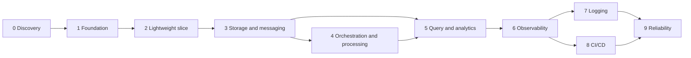

# Kubernetes migration execution plan

## Purpose

Migrate the modern lakehouse from Docker Compose to Kubernetes in independently
enabled, testable, reversible phases while preserving the working Compose platform
and keeping normal laptop usage safe.

## Current architecture summary

Discovery found 29 services: 24 core services in `docker-compose.yaml` and five
Airflow services in `airflow.yaml`. The platform combines two PostgreSQL sources,
Kafka/Schema Registry/Kafka Connect CDC, Flink streams, MinIO/Iceberg/Spark batch
processing, Trino, ClickHouse, OpenSearch, Superset, Streamlit, and Airflow. There
is no existing Kubernetes, Helm, CI/CD, metrics, or centralized-log deployment.
See the service inventory and dependency map for evidence.

## Assumptions

- Docker Compose is the current known deployment and remains available for rollback.
- The full platform does not fit safely on the developer laptop.
- Static validation is preferred until a single slice is explicitly approved.
- Environment values in `.env` are local and must never be printed or committed.
- Stateful deployment artifacts will be selected and pinned at their phase gate,
  because current maintenance status is time-sensitive.

## Constraints

- Do not start or deploy the full platform.
- Do not delete or mutate current volumes and bind-mounted state.
- Do not change Compose behavior for Helm convenience.
- Do not introduce an unpinned image, chart, or downloaded artifact.
- Do not deploy a component, operator, CRD, or secret manager before approval.
- Every component is opt-in and disabled components render no resources or secrets.

## Decisions made

- [ADR-001](../adr/001-kubernetes-packaging-strategy.md): thin Helm platform chart.
- [ADR-002](../adr/002-feature-flag-strategy.md): centralized feature flags and
  dependency validation.
- [ADR-003](../adr/003-compose-coexistence.md): phased authority and Compose rollback.
- [ADR-004](../adr/004-stateful-service-strategy.md): maintained charts/operators
  or external services for complex state.
- [ADR-005](../adr/005-secrets-management-strategy.md): Secret references only.
- [ADR-006](../adr/006-first-vertical-slice.md): accepted item-seeding slice.
- [ADR-007](../adr/007-local-kubernetes-distribution.md): kind for local Phase 2.
- [ADR-008](../adr/008-phase3a-storage-and-catalog-strategy.md): bounded Phase 3A
  storage, development-only MinIO compatibility, and Apache Polaris direction.

## Milestones and phases

### Phase 0: Discovery and architecture inventory

Status: complete in this branch.

Deliverables: complete service inventory, dependency and data-flow map, state and
resource classification, risks, resource-aware profiles, and vertical-slice matrix.

Acceptance:

- all Compose services appear exactly once in the inventory;
- declared, runtime, and optional dependencies are distinguished;
- unknowns and unmeasured resource assumptions are explicit;
- both Compose definitions pass static normalization.

Rollback: documentation-only; remove newly added documents if rejected. Compose is
unchanged.

### Phase 1: Repository and Kubernetes foundation

Status: complete and approved on 2026-07-22.

Deliverables: repository guidance, ADRs, platform docs, namespace definition, Helm
chart metadata, schema, profile overlays, dependency/phase validation, and safe
validation scripts. The chart renders no application workloads.

Acceptance:

- default and every profile render exactly one Namespace;
- `namespace.create=false` renders no resources;
- schema rejects unknown features and types;
- unmet dependencies and planned features fail with clear messages;
- no Secret object, credential, image, or Phase 2 workload is introduced;
- Compose normalization still passes.

Rollback: delete only the newly added `infrastructure/`, Phase 0/1 docs, and root
guidance; no runtime state is affected. No rollback action is performed without
approval.

### Phase 2: First lightweight vertical slice

Status: implemented and runtime-accepted on 2026-07-22.

Scope: migrate `items-loadgen` as a finite Job and one disposable CloudNativePG
development Cluster. Use kind `v0.31.0`/Kubernetes `v1.35.0`, CloudNativePG
`v1.29.2`, PostgreSQL 18.4 pinned by OCI index, a 1 GiB PVC, and a 100-row fixture.
Do not include CDC or messaging despite the current Compose database name.

Dependencies: Docker, checksum-verified temporary kind/kubectl/Helm clients, CNPG
operator installation, locally built/loadable Job image, and an uncommitted local
Secret. These choices are accepted in ADR-006 and ADR-007.

Acceptance:

- explicit requests/limits, safe pod security, verified readiness, graceful Job
  behavior, and no service-account token where unnecessary;
- expected row evidence from a small fixture;
- documented and tested rerun semantics;
- flags produce or suppress all slice resources as a unit;
- no plaintext secret or credential log output;
- rollback preserves PVC data by default;
- Compose remains valid and no Phase 3 service is deployed.

Rollback: hibernate the CNPG Cluster with `cnpg.io/hibernation=on`, leave its PVC
intact, and return authority to the unchanged Compose path. Do not uninstall the
Cluster release or delete the kind cluster/PVC without a separate explicit cleanup
decision.

### Phase 3: Core storage and messaging

Status: Phase 3A implemented and runtime-accepted by 2026-07-23; Phase 3B is
planned and not approved.

Phase 3A storage scope: main PostgreSQL, local S3-compatible MinIO/bootstrap, and
the Iceberg catalog decision. The `batch` overlay enables only these storage
resources in a separate `lakehouse-storage` Helm release. Main PostgreSQL reuses
CloudNativePG with a digest-pinned standard PostgreSQL 18.4/pgvector image. Because
upstream MinIO is archived and its last fixed release has no community container,
the local compatibility image is reproducibly built from that exact source and is
explicitly not a production recommendation. Apache Polaris 1.6.0 is selected as
the maintained catalog direction, but its authenticated persistent deployment is
deferred to a bounded catalog integration sub-slice.

Phase 3A acceptance: external Secret references, explicit resources, private
buckets, NetworkPolicies, retained PVC ownership, idempotent bootstrap, PostgreSQL
logical backup/restore, database and object persistence across restart/hibernation,
profile-scoped smoke tests, and unchanged Phase 2 PVC identity.

Phase 3B messaging candidate scope: Kafka, Schema Registry, Kafka Connect and
connector Jobs, CDC PostgreSQL, generators, and Redpanda Console. Each remains
separately optional. Acceptance additionally requires topic/connector idempotency,
replay checks, broker storage recovery, bounded generators, and a separate laptop
resource gate.

### Phase 4: Orchestration and processing

Status: planned.

Candidate scope: Spark Jobs/operator, Flink operator/jobs, Airflow chart/database,
MailHog development option, and synthetic batch generator. Correct and test the
Flink SQL defect and separate Spark initialization from long-running serving.

Acceptance: bounded jobs, checkpoint/savepoint strategy, DAG import tests,
non-destructive fixtures, retry/timeout semantics, and profile resource budgets.

### Phase 5: Query, analytics, search, and visualization

Status: planned.

Candidate scope: Trino, ClickHouse, OpenSearch item search, Superset, and Streamlit.
Do not label OpenSearch centralized logging until log ingestion exists.

Acceptance: authenticated query paths, durable analytics data, tested dashboards,
metadata backup, backend-specific readiness, and endpoint exposure policy.

### Phase 6: Observability

Status: planned; no implementation exists.

Candidate scope: metrics contracts, Prometheus-compatible collection, Grafana,
Alertmanager, ServiceMonitors where their CRDs exist, SLOs, and actionable alerts.

Acceptance: bounded cardinality, component/data-pipeline signals, alert routing,
dashboard ownership, and no default laptop deployment of the complete stack.

### Phase 7: Centralized logging

Status: planned; no collector/dashboard exists.

Candidate scope: Fluent Bit or an evaluated alternative, existing OpenSearch reuse,
retention/index lifecycle, redaction, and OpenSearch Dashboards if selected. Do not
introduce Elasticsearch only for naming parity.

Acceptance: secret/PII redaction, bounded retention, backpressure behavior, search
smoke test, and separation or capacity protection for item-search indexes.

### Phase 8: CI/CD and release automation

Status: planned; design only is documented.

Candidate scope: lint/test, Compose validation, chart rendering, schema checks,
image build/SBOM/scan/sign/publish, manual development deployment, smoke tests,
then promotion automation and optional GitOps.

Acceptance: immutable artifacts, separate CI/CD credentials, protected
environments, concurrency controls, and rehearsed rollback.

### Phase 9: Reliability and failure testing

Status: planned.

Candidate scope: data contracts, DLQs, replay/idempotency, data-quality checks,
failure injection, backup/restore, disaster recovery, runbooks, and SLOs.

Acceptance: documented recovery objectives based on evidence, restore drills,
failure-safe producer/consumer behavior, and actionable runbooks.

## Phase dependencies

Boundaries may be split after measured local-resource evidence, but they must not
be silently combined.

## Validation strategy

- Every change: Compose `config -q`, merged-values schema, Helm lint/render for all
  profiles, invalid combination tests, and disabled-resource assertions.
- Workload phase: schema validation, unit tests, image scan, one profile render,
  then explicit-approval runtime smoke test.
- Stateful phase: backup, restore, upgrade, failure, and data-retention tests on
  disposable data before acceptance.
- Cross-phase: verify authority/rollback record and prevent duplicate writers.

The safe entry point is `infrastructure/scripts/validate-platform.sh`; it detects
optional tools, skips missing validators explicitly, and never starts or applies a
service.

### Phase 0-1 validation record (2026-07-22)

- Docker Compose v5.3.1 normalized both Compose files without starting services.
- Python/PyYAML/jsonschema validated the inventory and base plus eight merged
  profile values; the inventory matched 24 core and five Airflow services exactly.
- A checksum-verified official Helm v3.21.1 binary was used temporarily from
  `/tmp`; all profile lint/render and feature behavior tests passed, then the
  temporary files were removed.
- `kubectl`, `kubeconform`, `yamllint`, `shellcheck`, and `markdownlint` were not
  installed and their checks were skipped. PyYAML/JSON Schema and `bash -n` provide
  partial syntax alternatives, but not full substitutes for those tools.
- No Compose service, container, Kubernetes resource, or data workload was started.

## Discoveries

- Compose has 29 services and no profiles or resource limits.
- Only Kafka and MinIO use named volumes; other state uses binds or container layers.
- Airflow has cross-file runtime dependencies that `depends_on` cannot express.
- Connector setup registers all connector JSON files and can leak expanded secrets
  on error.
- Existing image references include unpinned/latest tags.
- OpenSearch is an item search sink, not a log platform.
- Flink SQL has a malformed identifier and no automated submission path.
- Items seeder is finite and small but not idempotent as documented.

## Risk and rollback strategy

The prioritized register is `docs/platform/migration-risks.md`. Every phase must
identify data ownership, stop duplicate writers, retain storage by default, and
prove the unchanged Compose fallback before authority transfers. No destructive
cleanup is part of an automated validation or rollback command.

## Progress checklist

- [x] Inspect repository and all Compose/deployment source.
- [x] Normalize both Compose files statically.
- [x] Inventory all 29 services.
- [x] Map declared/runtime/optional dependencies.
- [x] Document resource profiles and risks.
- [x] Select a proposed first slice.
- [x] Add repository guidance and ADRs.
- [x] Add foundation-only chart, schema, profiles, and namespace.
- [x] Add feature dependency and implementation-gate tests.
- [x] Add safe validation/rendering scripts.
- [x] Receive Phase 0/1 approval.
- [x] Select and pin kind, Kubernetes, Helm, CloudNativePG, and PostgreSQL artifacts.
- [x] Begin Phase 2.
- [x] Add the hardened item Job, CNPG Cluster, bootstrap, policies, and local lifecycle scripts.
- [x] Complete image build, kind runtime smoke/rerun, and hibernation validation.
- [x] Receive explicit approval to begin Phase 3.
- [x] Split Phase 3A storage from Phase 3B messaging.
- [x] Select pinned PostgreSQL/MinIO build artifacts and the Polaris catalog direction.
- [x] Add Phase 3A chart resources, image builds, Secret/lifecycle helpers, and static tests.
- [x] Complete Phase 3A image and runtime persistence/recovery validation.

## Unresolved questions

1. Which CDC PostgreSQL image/extension strategy should replace the incompatible
   shared bootstrap? The main PostgreSQL bootstrap is now separate, but Phase 3B
   must decide the CDC image before deployment.
2. Which existing tracked credential literals may be removed/rotated without
   breaking the user's Compose workflow?
3. What durability is intended for the current ephemeral PostgreSQL, ClickHouse,
   and OpenSearch data?

### Phase 2 validation record (2026-07-22)

- Verified checksum-pinned kind `v0.31.0`, kubectl `v1.35.0`, Helm `v3.21.1`,
  and the CloudNativePG `v1.29.2` manifest. The single kind node reported Ready
  on Kubernetes `v1.35.0`.
- Built the digest-pinned Python 3.12 item image as non-root; all six unit tests
  passed in a read-only container. The loaded runtime config image ID was
  `sha256:ad56eaa9bc7af20c2091e98faf42a5afc6f0c50d7d339ccdf1e0f23cbd57c958`.
- The installed PostgreSQL container resolved to OCI index
  `sha256:9287ce030c6f3ce822e383b019ae4aaf1e8370bff3b39f9c51dc10d69dc97219`.
- API-server dry-run accepted all five namespace-scoped Phase 2 objects after the
  raw namespace was created. CloudNativePG reached healthy/Ready with one bound
  1 GiB PVC; both NetworkPolicies were present.
- The clean Job inserted exactly 100 rows owned by `items_app`. Deleting and
  recreating the Job produced the expected `skip-if-present` log and left the
  row count at 100.
- Runtime testing exposed and fixed two bootstrap defects: a newline in the
  generated password file and superuser ownership of the items table. Each failed
  attempt had zero rows; only its exact disposable Helm release/PVC was removed
  before the clean retest. No user/Compose data was touched.
- Hibernation removed the PostgreSQL pod and retained the bound 1 GiB PVC. A
  resume test waited for the real primary Pod, confirmed all 100 rows survived,
  and hibernated the Cluster again. This test also caught and fixed an initial
  helper race against CNPG's stale pre-resume Ready condition. The kind control
  plane and CNPG operator remain available; no automated cleanup ran.
- Full static validation passed: both Compose files, inventory, JSON Schema,
  eight Helm overlays, feature/dependency tests, Bash/Python syntax, Secret/latest
  assertions, and kubectl client dry-run. `kubeconform`, `yamllint`, `shellcheck`,
  and `markdownlint` were unavailable and explicitly skipped.

### Phase 3A validation record (2026-07-22 to 2026-07-23)

- Built MinIO from checksum-pinned final fixed source commit
  `9e49d5e7a648f00e26f2246f4dc28e6b07f8c84a` with the pinned Go 1.24.8 and
  distroless inputs. The version check reported
  `RELEASE.2025-10-15T17-29-55Z`; the loaded image ID was
  `sha256:30f2f7909be49e9b42d72a79326b4b1e0e85c81fbd2c412142c4afcff1870bbb`.
- Checksum-verified `mc` `RELEASE.2025-08-13T08-35-41Z`; its loaded image ID
  was `sha256:285ede5f7d5be5ad09c2493f62173e67c194b7930488cf471c11987b0cd5d878`.
- The API server accepted all eight namespace-scoped Phase 3A objects in server
  dry-run. The `batch` profile renders nine resources including the optional
  Namespace; disabled profiles and invalid combinations passed their assertions.
  NetworkPolicy enforcement was not claimed because an enforcing CNI and explicit
  allowed/denied traffic matrix were outside this local cluster's validation.
- Generated two local Secret objects without logging values. The main database
  reached Ready on the digest-pinned PostgreSQL 18.4 standard image. Runtime SQL
  confirmed pgvector, `users`, `items`, `purchases`, `reviews`, and exactly 13
  review fixtures.
- A custom-format logical dump restored into a temporary database; all four table
  row counts matched before the temporary database was force-dropped. This proves
  logical recovery for the development fixture, not WAL/PITR or a production RPO.
- The finite client created private `warehouse`, `pageviews`, and
  `postgres-backups` buckets. After MinIO pod recreation, the same PVC UID and
  existing marker were observed; the rerun reported retained rather than created.
- Hibernation removed both Phase 3A stateful pods while retaining two bound 2 GiB
  PVCs. Resume preserved PostgreSQL counts, then the slice was hibernated again.
  The retained Phase 2 1 GiB PVC UID was identical before and after the test.
- A repeat run from the hibernated state exposed CNPG's stale pre-resume Ready
  condition. The helper now waits for the actual primary Pod and Pod readiness;
  the complete restore/restart/hibernate smoke passed again with that fix.
- Full static validation passed both Compose models, inventory/schema, eight Helm
  profiles, feature tests, Bash/Python syntax, Secret/latest/fixture-credential
  assertions, and kubectl client dry-run. `kubeconform`, `yamllint`, `shellcheck`,
  and `markdownlint` remain unavailable and were explicitly skipped; API-server
  dry-run and live acceptance cover the deployed Kubernetes schemas.
- `trivy`, `grype`, `syft`, and Docker Scout were unavailable, so no local image
  CVE/SBOM scan was claimed. Source/release checksums, immutable base images, Go
  module sums, non-root runtime checks, and the upstream security-fix selection
  provide supply-chain controls but do not replace a scanner.

## Next approved action

Stop. Phase 3A is accepted and hibernated with all three Phase 2/3A PVCs retained.
Do not begin Phase 3B, deploy Polaris/Spark, uninstall either Helm release, or
delete the kind cluster/PVCs without another explicit approval.
