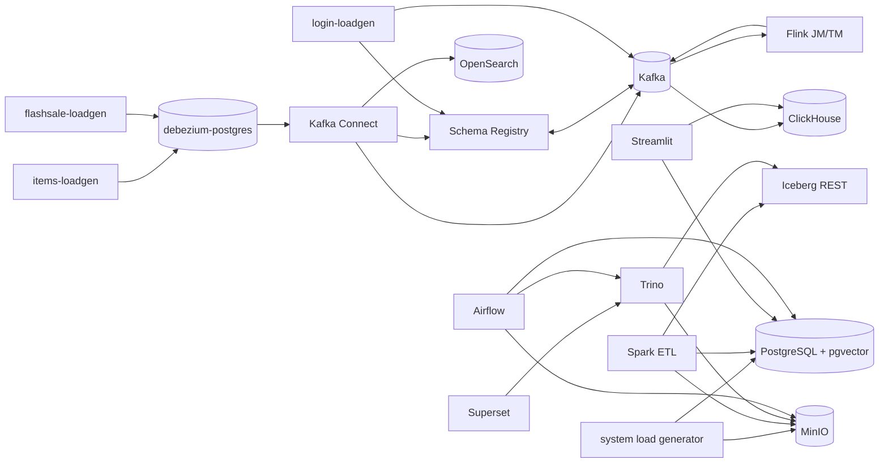

# Dependency map

## Relationship semantics

- **Declared** means normalized Compose `depends_on`; it controls ordering only at
  the configured condition.
- **Runtime** is evidenced by hostnames, URLs, protocols, SQL, or application code.
- **Optional** is an integration that is not required for the process to start or
  is invoked only by a particular job/page.

## Service relationships

| Service | Declared dependencies | Runtime dependencies | Optional or hidden integrations |
| --- | --- | --- | --- |
| `debezium-postgres` | none | bootstrap SQL | Kafka Connect reads its WAL later |
| `items-loadgen` | `debezium-postgres` healthy | `debezium-postgres` | none |
| `flashsale-loadgen` | `debezium-postgres` healthy | `debezium-postgres` | drives purchase CDC/ClickHouse path |
| `postgres` | none | bootstrap SQL | Spark JDBC, Streamlit review page, embedding DAG |
| `loadgen` | `postgres` healthy, `minio` started | `postgres`, `minio` | `mc` must have created the pageviews bucket, but is undeclared |
| `kafka` | none | named storage volume | all messaging consumers/producers |
| `kafka-setup` | `kafka` healthy | `kafka` | creates four explicitly listed topics; CDC topics rely on auto-create |
| `schema-registry` | `kafka` started | `kafka` | none |
| `connect` | `kafka`, `debezium-postgres`, `schema-registry` started | `kafka`, `schema-registry` | database and OpenSearch are connector-level dependencies |
| `connector-setup` | `connect` started | `connect`, `debezium-postgres`, `schema-registry`, `opensearch` | registers every JSON file, including purchases source |
| `login-loadgen` | `kafka`, `schema-registry` healthy | `kafka`, `schema-registry` | none |
| `redpanda-console` | none | `kafka`, `schema-registry` | monitoring-only |
| `jobmanager` | none | mounted Flink SQL/JARs/CSV | Kafka and Schema Registry when jobs are manually submitted |
| `taskmanager` | `jobmanager` started | `jobmanager`, mounted JARs/CSV | Kafka and Schema Registry for active jobs |
| `clickhouse` | `kafka`, `schema-registry` started | `kafka`, `schema-registry` | purchases topic is produced by Connect from `debezium-postgres` |
| `opensearch` | none | none to start | Kafka Connect sink writes items |
| `minio` | none | named storage volume | Spark, Iceberg REST, Trino, Airflow, load generator |
| `mc` | `minio` started | `minio` | creates warehouse/pageviews buckets and public warehouse access |
| `rest` | none | MinIO/S3 configuration | Spark and Trino clients |
| `spark-iceberg` | `rest`, `minio` started | `rest`, `minio` | `postgres` only for JDBC ETL; a fixed sleep substitutes for readiness |
| `trino` | none | `rest`, `minio` | Superset and Airflow are clients |
| `superset-db` | none | bind-mounted PostgreSQL data | none |
| `superset` | `superset-db` started | `superset-db` | Trino is the configured analytics connection but undeclared |
| `streamlit` | `clickhouse`, `postgres` healthy | `clickhouse`, `postgres` | each page uses a different backend |
| `airflow-db` | none | bind-mounted PostgreSQL data | none |
| `airflow-init` | `airflow-db` started | `airflow-db` | creates admin and metadata; no database health gate |
| `airflow-scheduler` | `airflow-init` completed | `airflow-db` | DAG-specific: Trino, MinIO, PostgreSQL, MailHog |
| `airflow-webserver` | `airflow-init` completed | `airflow-db` | exposes UI/config; loads all DAG imports |
| `mailhog` | none | none | Airflow email task/SMTP configuration |

## Data dependency view

## Network and authentication relationships

Every service joins `iceberg_net`; there is no network segmentation. Most service
DNS references are bare Compose service names. Kafka, Schema Registry, Connect,
Flink, Trino, Iceberg REST, MailHog, and OpenSearch use inspected plaintext or
unauthenticated endpoints. PostgreSQL, MinIO, ClickHouse, Superset, and Airflow use
passwords/keys from environment variables or tracked development defaults. The
connector registration script expands database credentials into a temporary JSON
payload and prints that payload on an error path.

## Independent services and useful slices

MailHog and Redpanda Console can start independently but have little platform value
without clients. The database services, Kafka, MinIO, OpenSearch, and ClickHouse
can start independently but are incomplete data paths. The smallest repository-
backed useful path is `items-loadgen` to a compatible PostgreSQL instance. It is
the recommended Phase 2 slice; CDC is deliberately excluded until Phase 3.
