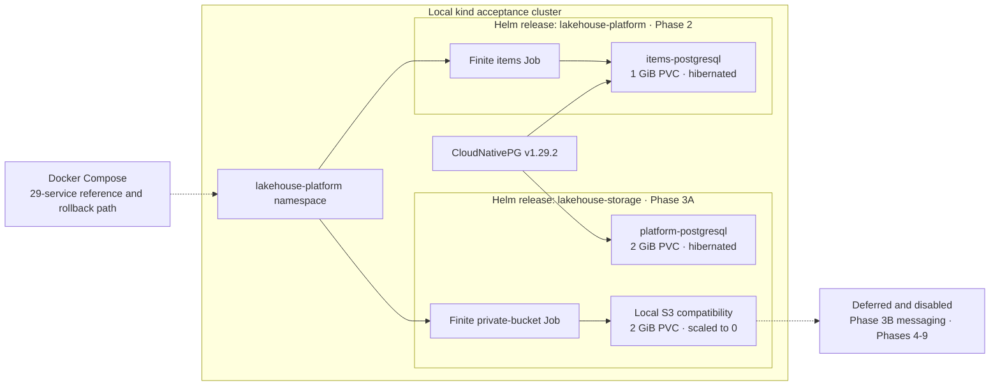

# Platform infrastructure

This directory is the Kubernetes migration boundary. Docker Compose remains
unchanged and authoritative outside the explicitly migrated Phase 2 and Phase 3A
test slices.

## Current migration state

This diagram is intentionally added now rather than deferred: separate Helm
releases, shared operator ownership, retained PVCs, and Compose coexistence are
already operational contracts. Update it when a phase changes those boundaries.



| Slice | Feature overlay | Live release | Accepted evidence | Resting state |
| --- | --- | --- | --- | --- |
| Foundation | Base values | none required | Schema, lint, render, disabled-resource tests | No workload |
| Phase 2 | `values-minimal.yaml` | `lakehouse-platform` | 100 rows, idempotent rerun, PVC resume | PostgreSQL hibernated |
| Phase 3A | `values-batch.yaml` | `lakehouse-storage` | pgvector/schema, logical restore, private buckets, object restart, PVC isolation | PostgreSQL hibernated; object store scaled to zero |
| Phase 3B+ | Disabled | none | Not accepted | Not deployed |

| Path | Purpose |
| --- | --- |
| `helm/lakehouse-platform/` | Central feature flags, dependency validation, profiles, and namespace template |
| `images/` | Reproducible local-only Phase 3A compatibility images |
| `kind/` | Pinned disposable local cluster configuration |
| `kubernetes/` | Bootstrap manifest and Kubernetes-specific operating guidance |
| `operators/cloudnative-pg/` | Operator/version/checksum decision record |
| `scripts/` | Static validation plus explicit Phase 2/3A lifecycle helpers |

Base values contain no application workload. The `minimal` overlay creates one
CloudNativePG Cluster, schema ConfigMap, item-seeding Job, and NetworkPolicies. It
references an externally created Secret and never commits credential material.
The opt-in `batch` overlay currently adds only the Phase 3A main CloudNativePG
Cluster, local MinIO StatefulSet, private-bucket Job, and NetworkPolicies. It is
installed as the separate `lakehouse-storage` release.

```bash
infrastructure/scripts/check-local-prerequisites.sh
infrastructure/scripts/validate-platform.sh
infrastructure/scripts/render-profile.sh minimal
infrastructure/scripts/render-profile.sh batch
```

Runtime scripts are intentionally separate from static validation. Run them only
for an approved slice. Phase 3A reuses the Phase 2 cluster/operator, then runs
`build-phase3a-images.sh`, `create-phase3a-secrets.sh`, and
`phase3a-smoke-test.sh`. The smoke test ends hibernated; `resume-phase3a.sh`
reverses that without recreating storage. No cleanup script is supplied because
PVC/image deletion requires an explicit decision.

The generated local Secret objects are prerequisites, not chart-owned resources.
The Phase 2 and Phase 3A releases must stay separate: upgrading one overlay over
the other is not a supported profile switch because it would change resource
ownership. A Helm upgrade can also restore the StatefulSet replica count, so run
the matching hibernation helper after an approved test or upgrade.

## Production boundary

The infrastructure is a high-quality local migration and acceptance harness, not
a production cluster definition. It deliberately lacks production environment
overlays, highly available control/data planes, multi-zone storage, TLS and
certificate automation, external secret management, physical PostgreSQL
backup/PITR, supported production object storage, policy-enforcing CNI evidence,
monitoring/alerting/logging, automated delivery, artifact scanning/signing, and
tested disaster recovery objectives. These are tracked by later phases and must
not be inferred from successful local smoke tests.

See `docs/plans/kubernetes-migration.md` for the phase gate and
`docs/platform/compose-kubernetes-coexistence.md` before mixed-mode testing.
